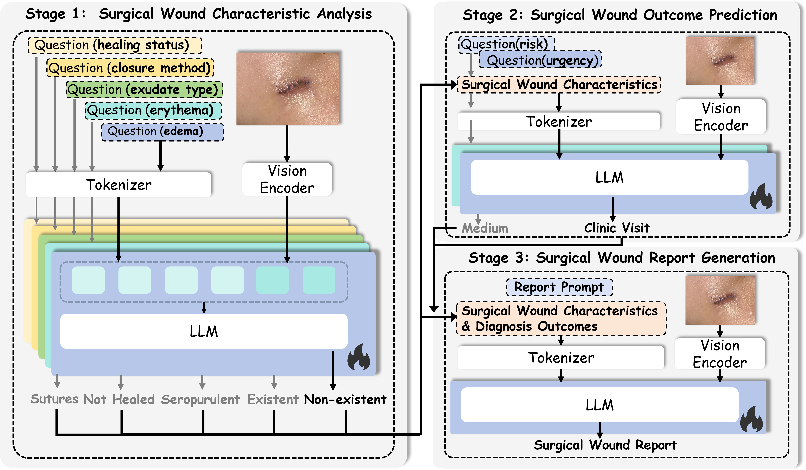

# SurgWound-Bench: A Benchmark for Surgical Wound Diagnosis

**SurgWound-Bench** is an open multimodal benchmark for surgical-wound analysis. It contains 686 de-identified surgical-wound images with eight clinical attributes annotated under a difficulty-aware review protocol involving a team of three professional surgeons, and supports both visual question answering (VQA) and medical-report generation. We also provide **WoundQwen**, a three-stage multimodal diagnostic framework that follows a clinically motivated workflow from wound-characteristic assessment to infection-risk/urgency triage and report generation.

**Resources**: [Paper](https://doi.org/10.1038/s41746-026-02791-3) · [Dataset and benchmark files](https://huggingface.co/datasets/xuxuxuxuxu/SurgWound) · [HF card source](HUGGINGFACE_README.md) · [arXiv preprint](https://arxiv.org/abs/2508.15189)

> The paper was published in *npj Digital Medicine* on 23 May 2026. This repository is the accompanying research code and data-processing/evaluation snapshot; it does not contain the original images or trained WoundQwen checkpoints.

## Paper

> **SurgWound-Bench: a benchmark for surgical wound diagnosis**
>
> Jiahao Xu, Changchang Yin, Odysseas P. Chatzipanagiotou, Diamantis I. Tsilimigras, Kevin Clear, Bingsheng Yao, Weidan Cao, Dakuo Wang, Timothy M. Pawlik, and Ping Zhang.
> *npj Digital Medicine* (2026). [https://doi.org/10.1038/s41746-026-02791-3](https://doi.org/10.1038/s41746-026-02791-3)

## Overview

Surgical site infection (SSI) is a common and costly healthcare-associated infection, while postoperative wound follow-up is often resource-intensive. SurgWound-Bench was created to make research on multimodal surgical-wound assessment more reproducible. The benchmark evaluates whether a model can:

1. identify fine-grained wound characteristics and diagnostic outcomes from an image (SurgWound-VQA); and
2. synthesize those findings into a clinically structured wound report (SurgWound-Report).

The released data were collected from publicly available online content, filtered with AI-assisted and surgeon review, de-identified, and annotated under the protocol described in the paper. The benchmark is intended for research and education, not for autonomous clinical decision-making.

## Dataset and benchmark at a glance

| Resource | Images | VQA records | Report records |
| --- | ---: | ---: | ---: |
| Train | 480 | 3,435 | 480 |
| Validation | 69 | 500 | 69 |
| Test | 137 | 979 | 137 |
| **Total** | **686** | **4,914** | **686** |

The image split is 480/69/137 (approximately 7:1:2). Each image has eight structured labels. VQA records with an `Uncertain` annotation are omitted from the corresponding question set, so the number of VQA records is not exactly eight times the number of images. The test split contains 137 images; only four test images are labeled `Emergency Care` (18 in the full dataset), so this subgroup should be interpreted with caution.

### Clinical attributes

The labels in the released JSON files use the following field names and values:

| Field | Values |
| --- | --- |
| `Wound Location` | Abdomen, Patella, Ankle, Facial region, Manus, Cervical region, Other, Uncertain |
| `Healing Status` | Healed, Not Healed |
| `Closure Method` | Invisible, Sutures, Staples, Adhesives, Uncertain |
| `Exudate Type` | Non-existent, Serous, Sanguineous, Purulent, Seropurulent, Uncertain |
| `Erythema` | Non-existent, Existent, Uncertain |
| `Edema` | Non-existent, Existent, Uncertain |
| `Infection Risk Assessment` | Low, Medium, High |
| `Urgency Level` | Full strings beginning `Home Care (Green):`, `Clinic Visit (Yellow):`, or `Emergency Care (Red):` |

The urgency descriptions used in the benchmark are:

- **Home Care (Green):** manage with routine care.
- **Clinic Visit (Yellow):** obtain professional evaluation within 48 hours.
- **Emergency Care (Red):** seek immediate medical attention.

The raw VQA files include `Wound Location` records. The paper's main WoundQwen analysis reports seven prediction sub-tasks (the five Stage 1 characteristics plus infection risk and urgency), because location is supplied as known clinical context rather than predicted by WoundQwen.

## WoundQwen

WoundQwen decomposes diagnosis into three stages:

1. **Wound-characteristic analysis.** Five LoRA-adapted Qwen-based MLLMs predict healing status, closure method, exudate type, erythema, and edema. Wound location is supplied as known clinical information rather than predicted by these five models.
2. **Diagnostic-outcome prediction.** `WoundQwen_risk` and `WoundQwen_urgency` use the image, known location, and Stage 1 predictions to estimate infection risk and urgency level.
3. **Report generation.** `WoundQwen_report` combines the image and the preceding structured predictions to generate a medical report.

The paper uses a Qwen2.5-VL-7B architecture initialized with HuatuoGPT-Vision-7B weights and supervised fine-tuning with LoRA. The repository includes scripts and the vendored LLaMA-Factory training framework, but no WoundQwen adapter or merged checkpoint.




## Downloading and reading the data

The data and the complete dataset card are hosted on [Hugging Face](https://huggingface.co/datasets/xuxuxuxuxu/SurgWound). The HF release contains six JSON files:

```text
train_question.json   # 3,435 VQA records / 480 unique images
val_question.json     #   500 VQA records /  69 unique images
test_question.json    #   979 VQA records / 137 unique images
train_report.json     #   480 report records / 480 unique images
val_report.json       #    69 report records /  69 unique images
test_report.json      #   137 report records / 137 unique images
```

Each file is a JSON **array**, not JSONL. Every record contains a base64-encoded JPEG in the `image` field; the same image payload is repeated across records that refer to that image. Treat `image_name` as the image-level key when deduplicating or evaluating: VQA rows are task records, not independent images. The six files total roughly 452 MB before JSON parsing. A minimal download command is:

```bash
python -m pip install -U "huggingface_hub>=0.34.3"
hf download xuxuxuxuxu/SurgWound \
  --repo-type dataset \
  --local-dir ./surgwound_data
```

To load a split and decode an image:

```python
import base64
import json
from io import BytesIO
from pathlib import Path

from huggingface_hub import hf_hub_download
from PIL import Image

path = hf_hub_download(
    repo_id="xuxuxuxuxu/SurgWound",
    repo_type="dataset",
    filename="test_question.json",
)
records = json.loads(Path(path).read_text(encoding="utf-8"))

record = records[0]
image = Image.open(BytesIO(base64.b64decode(record["image"]))).convert("RGB")
print(record["field"], record["answer"], image.size)
```

The original processing and evaluation scripts in this repository were written for a local research workflow. Most of the processors read one JSON object per line, expect image files named by `image_name`, and contain blank or machine-specific path/model variables. If you use those scripts, first convert the downloaded arrays to JSONL and decode one local image per `image_name`, or adapt the scripts to read the array format directly. For example:

```python
import base64
import json
from io import BytesIO
from pathlib import Path

from PIL import Image

src = Path("surgwound_data/test_question.json")
out_jsonl = Path("test_question.jsonl")
image_dir = Path("images")
image_dir.mkdir(exist_ok=True)

records = json.loads(src.read_text(encoding="utf-8"))
seen = set()
with out_jsonl.open("w", encoding="utf-8") as f:
    for row in records:
        row_without_image = {k: v for k, v in row.items() if k != "image"}
        f.write(json.dumps(row_without_image, ensure_ascii=False) + "\n")
        name = row["image_name"]
        if name not in seen:
            image = Image.open(BytesIO(base64.b64decode(row["image"]))).convert("RGB")
            image.save(image_dir / name)
            seen.add(name)
```

## Installation

The top-level `requirement.txt` is a historical environment snapshot, not a portable lockfile. In particular, the `yaml==0.2.5` and `torchtriton==3.1.0` pins are not generally installable from PyPI, and the data/evaluation scripts additionally need `datasets`, `qwen-vl-utils`, `pandas`, `openpyxl`, and `nltk`. Install a CUDA-compatible PyTorch build from the [official PyTorch instructions](https://pytorch.org/get-started/locally/), then install versions compatible with that build. If you reuse `requirement.txt`, first remove or skip its `torch`, `torchvision`, `torchaudio`, `torchtriton`, and `yaml` pins so that pip does not replace your tested CUDA/PyTorch stack. For example:

```bash
cd SurgWound
python -m venv .venv
source .venv/bin/activate
python -m pip install --upgrade pip
python -m pip install "huggingface_hub>=0.34.3" datasets qwen-vl-utils pandas openpyxl nltk
# Install the remaining compatible packages from requirement.txt only after
# excluding its framework-specific torch*/torchtriton and invalid yaml pins.
```

For training, install the vendored LLaMA-Factory checkout separately (Python >= 3.9 and a CUDA-capable GPU are recommended):

```bash
cd train/LLaMA-Factory
python -m pip install -e ".[torch,metrics]" --no-build-isolation
```

Download or otherwise make available the model foundation used by your experiment:

- [Qwen2.5-VL-7B-Instruct](https://huggingface.co/Qwen/Qwen2.5-VL-7B-Instruct)
- [HuatuoGPT-Vision-7B-Qwen2.5VL](https://huggingface.co/FreedomIntelligence/HuatuoGPT-Vision-7B-Qwen2.5VL)

The model and adapter paths in the scripts are placeholders. Update them for the local machine before launching inference or evaluation.

## Reproduction workflow

The following commands describe the intended research workflow. They are not a one-click pipeline: paths, data conversion, model checkpoints, and LLaMA-Factory dataset registration must be configured first.

### 1. Optional image augmentation

`data/enhancement.py` creates additional augmented images for selected infection-risk classes. `data/Qwen_bbox.py` uses Qwen2.5-VL to crop wound regions. Set the input/output paths in each script before running:

```bash
python data/enhancement.py
python data/Qwen_bbox.py
```

### 2. Convert benchmark records to training data

The processors read a prepared JSONL file and write LLaMA-Factory-compatible files (`closure.json`, `status.json`, `exudate.json`, `erythema.json`, `edema.json`, `risk.json`, `urgency.json`, and `report.json`). Set `path`, `image_path`, and the spreadsheet location in the scripts first. The tracked `data/records_processed.xlsx` is an image-level annotation/metadata table used by the legacy processors. It is not one of the six HF files and should be handled under the same privacy and redistribution constraints. The scripts currently look for `records_processed.xlsx` in the working directory unless that path is changed.

```bash
python data/process_closure.py
python data/process_status.py
python data/process_exudate.py
python data/process_erythema.py
python data/process_edema.py
python data/process_risk.py
python data/process_urgency.py
python data/process_report.py
```

### Schema compatibility note

The public HF release and the checked-in processors are from different stages of the project. The HF files use the canonical paper names `Healing Status` and `Exudate Type`, while the legacy processors and spreadsheet use `Wound Status` and `Exudate Characteristics`. The same legacy names are referenced throughout parts of `data/` and `eval/`. Consequently, the commands above do **not** consume the current HF JSON arrays unchanged: normalize the field names (and convert the arrays to JSONL) or update the scripts before running them.

The report-generation `question` strings in the HF files also retain the legacy prose “wound status” and “exudate characteristics”; these refer to the canonical `Healing Status` and `Exudate Type` attributes and do not introduce additional labels.

| Current HF field | Legacy processor/spreadsheet field |
| --- | --- |
| `Healing Status` | `Wound Status` |
| `Exudate Type` | `Exudate Characteristics` |

The current HF files and the tracked spreadsheet collectively cover 686 unique images. Earlier descriptions using 697 total images or 173 test images are stale; the current release and published article use 686 total images and 137 test images. The remaining incompatibility is the legacy field naming and file format.

### 3. Register the datasets in LLaMA-Factory

Add entries for the generated files to `train/LLaMA-Factory/data/dataset_info.json` (or place the files in that directory). A representative entry is:

```json
"surgwound_closure": {
  "file_name": "closure.json",
  "formatting": "sharegpt",
  "columns": {"messages": "messages", "images": "images"},
  "tags": {
    "role_tag": "role",
    "content_tag": "content",
    "user_tag": "user",
    "assistant_tag": "assistant"
  }
}
```

Create analogous entries for `status`, `exudate`, `erythema`, `edema`, `risk`, `urgency`, and `report`. The checked-in `qwen2_5vl_lora_sft.yaml` is still the upstream demo configuration (`mllm_demo`, `identity`, and `alpaca_en_demo`); replace its `dataset` value and model/output paths with the dataset and checkpoint for the stage being trained.

### 4. Train the three-stage framework

Train five Stage 1 adapters (`closure`, `status`, `exudate`, `erythema`, `edema`), then the Stage 2 `risk` and `urgency` adapters, and finally the Stage 3 `report` adapter. Use the `qwen2_vl` template configured for Qwen2.5-VL and the LoRA SFT settings in `train/LLaMA-Factory/examples/train_lora/qwen2_5vl_lora_sft.yaml`, adjusting the dataset, model, output, and evaluation settings for each stage.

### 5. Evaluate

Stage 1 attribute evaluation:

```bash
python eval/eval_closure.py
python eval/eval_status.py
python eval/eval_exudate.py
python eval/eval_erythema.py
python eval/eval_edema.py
```

Generate Stage 1 predictions:

```bash
python eval/generation.py
```

The checked-in file names still reflect the original local workflow: `generation.py` writes `result_train.xlsx`, while the downstream Stage 2 scripts read `result.xlsx`. Configure a single consistent path (or rename the generated workbook) before continuing. The Stage 2 entry points are:

```bash
python eval/eval_risk.py
python eval/eval_urgency.py
python eval/risk_generation.py
python eval/urgency_generation.py
```

The `risk_generation.py` and `urgency_generation.py` scripts add Stage 2 predictions to that workbook for later report generation; the corresponding `eval_*.py` scripts compute task metrics. These scripts still require their model, data, image, and workbook paths to be configured before use.

Report generation and automatic evaluation:

```bash
python eval/report_generation.py
python eval/eval_report.py
```

The evaluation scripts assume local test JSONL files, local images, trained adapters, and intermediate Excel files. They must be edited to point to those artifacts; private absolute paths from the original development environment are not part of this release.

## Reproducibility and known limitations of this code snapshot

- The repository does not ship the original wound images, trained weights, prediction spreadsheets, or intermediate JSON files; download the data from Hugging Face and supply your own checkpoints.
- Several scripts contain blank path variables or machine-specific paths and therefore cannot run unchanged on a fresh clone.
- The public HF files are JSON arrays with embedded base64 images, whereas the legacy scripts expect JSONL records plus local JPEG files.
- LLaMA-Factory is vendored, but its checked-in YAML and `dataset_info.json` still describe upstream demo data. SurgWound entries must be registered manually as shown above.
- Intermediate files such as Stage 1 predictions are consumed by later scripts. In particular, `result_train.xlsx` versus `result.xlsx` and the blank workbook paths in `report_generation.py` must be reconciled manually; keep filenames and columns consistent when adapting the workflow.
- Results reported in the paper are benchmark experiments, not a clinical validation of an autonomous diagnostic device. In particular, the `Emergency Care` class has only four test examples, and performance may not generalize to other hospitals, procedures, cameras, skin tones, or social-media populations.

## Ethics, privacy, and intended use

The source images were publicly available online content from platforms including RedNote, Twitter, Facebook, Instagram, and Reddit. The curation pipeline removed or obscured identifiable information (including facial regions and social-media identifiers) and randomly renamed images. The study followed the Declaration of Helsinki. The protocol was reviewed by The Ohio State University Institutional Review Board and classified as Exempt Category 4; informed consent was not required for the publicly available, irreversibly de-identified data, as described in the paper.

De-identification does not guarantee zero re-identification risk; users must not attempt to identify or contact individuals depicted in the data. This dataset and code are for research, education, and benchmarking. They are **not** medical advice and must not be used to make or communicate a diagnosis, urgency recommendation, or treatment decision without qualified clinical review. Users should comply with applicable privacy, copyright, platform, and data-protection requirements when redistributing or creating derivative resources.

## License

The dataset is released under **CC BY-SA 4.0** as documented in the paper and on the Hugging Face dataset card: [creativecommons.org/licenses/by-sa/4.0](https://creativecommons.org/licenses/by-sa/4.0/). The published article is separately licensed under **CC BY-NC-ND 4.0**. The vendored `train/LLaMA-Factory` subtree retains its upstream Apache-2.0 license; this repository currently does not declare a separate top-level license for the SurgWound-specific code.

## Citation

If you use SurgWound, SurgWound-Bench, or WoundQwen, please cite the published article:

```bibtex
@article{xu2026surgwoundbench,
  author  = {Xu, Jiahao and Yin, Changchang and Chatzipanagiotou, Odysseas P. and
             Tsilimigras, Diamantis I. and Clear, Kevin and Yao, Bingsheng and
             Cao, Weidan and Wang, Dakuo and Pawlik, Timothy M. and Zhang, Ping},
  title   = {SurgWound-Bench: a benchmark for surgical wound diagnosis},
  journal = {npj Digital Medicine},
  year    = {2026},
  month   = may,
  day     = {23},
  doi     = {10.1038/s41746-026-02791-3},
  url     = {https://doi.org/10.1038/s41746-026-02791-3}
}
```

For questions or corrections, please open an issue in this repository or contact the corresponding author listed in the paper.
